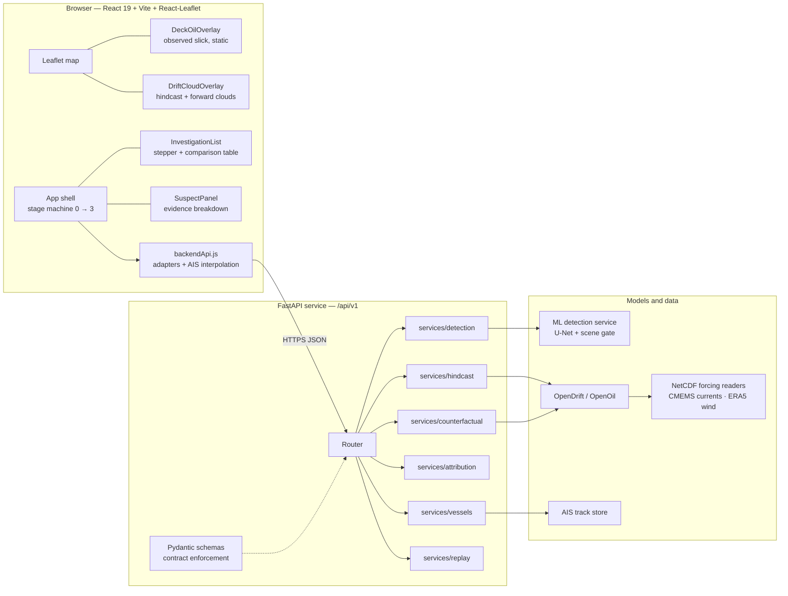
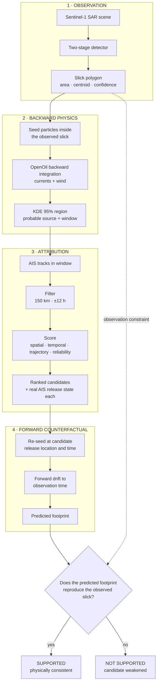
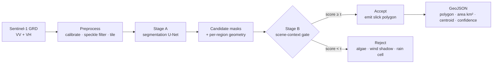
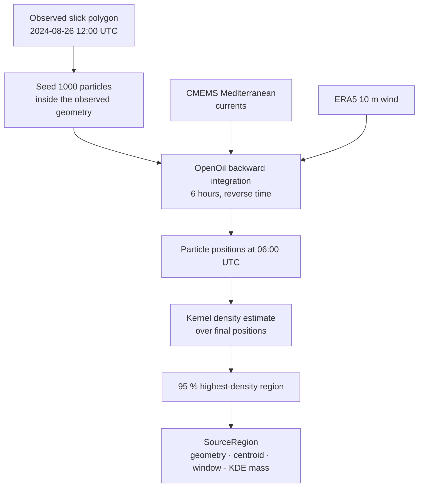
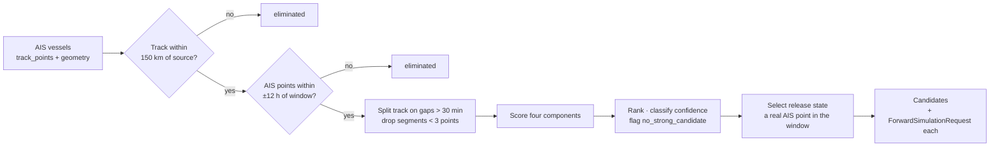
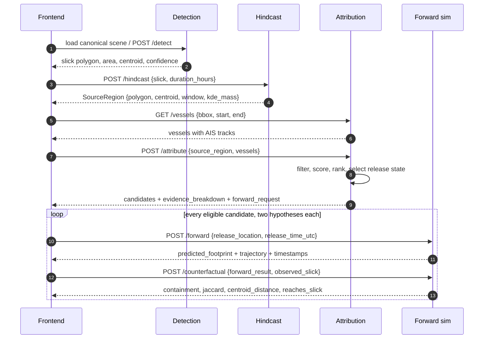
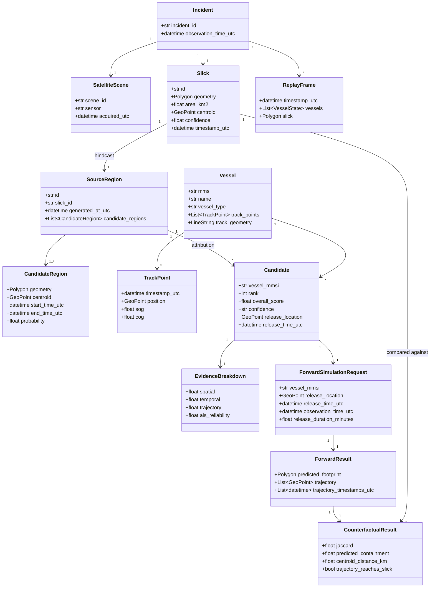
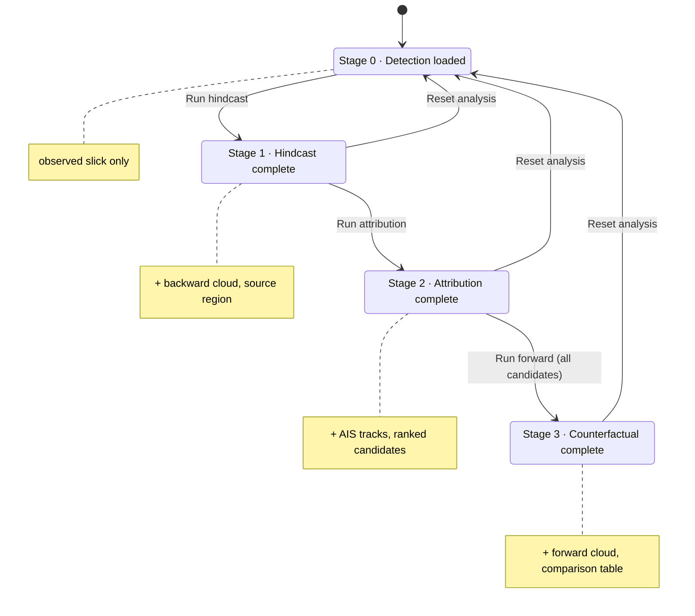

# OilTrace

**Satellite oil-spill detection, source reconstruction and vessel attribution**

Smart India Hackathon 2026 · Problem Statement SIH26143 (NTRO) · Team AlgoRise

A detector answers *where is the oil*. OilTrace answers *where did it come from, who was there, and does the physics actually support that story* — and it keeps the uncertainty visible in every one of those answers instead of collapsing to a single confident origin.

## Deployments

| Component | Where | URL |
|---|---|---|
| Frontend | Vercel | `frontend/` — see [Deploy the frontend](#deploy-the-frontend-on-vercel) |
| Backend API | Modal | https://vscimatic999--oiltrace-backend-web.modal.run/api/v1 |
| API docs (Swagger) | Modal | https://vscimatic999--oiltrace-backend-web.modal.run/docs |
| ML detection service | Modal | https://vscimatic999--oiltrace-detection-web.modal.run |

Every component also runs locally; see [Run it locally](#run-it-locally).

## Contents

1. [What OilTrace does](#what-oiltrace-does)
2. [System architecture](#system-architecture)
3. [The investigation loop](#the-investigation-loop)
4. [Stage 1 — SAR detection](#stage-1--sar-detection)
5. [Stage 2 — Backward hindcast](#stage-2--backward-hindcast)
6. [Stage 3 — AIS attribution](#stage-3--ais-attribution)
7. [Stage 4 — Forward counterfactual](#stage-4--forward-counterfactual)
8. [End-to-end sequence](#end-to-end-sequence)
9. [Data model](#data-model)
10. [Frontend](#frontend)
11. [API reference](#api-reference)
12. [Canonical scenario walkthrough](#canonical-scenario-walkthrough)
13. [Run it locally](#run-it-locally)
14. [Deploy the frontend on Vercel](#deploy-the-frontend-on-vercel)
15. [Results and validation](#results-and-validation)
16. [Limitations](#limitations)
17. [Repository structure](#repository-structure)

---

## What OilTrace does

Operational satellite services already detect oil at sea, then hand an alert package to a human analyst who does the reasoning that links slick to source to ship. That reasoning is slow, expert-dependent and rarely reproducible. Three gaps follow:

- **The source is never computed, only inferred.** A slick observed at noon has been drifting for hours. Its centroid is not the discharge point, and the difference is routinely tens of kilometres.
- **Proximity is treated as evidence.** The nearest vessel on the AIS plot is not necessarily the responsible one; the responsible one may have left the frame entirely.
- **Nothing tests the hypothesis.** Once a candidate is named, no step in the conventional workflow attempts to falsify it.

OilTrace closes all three by making each one an explicit, automated, inspectable stage:

```text
Sentinel-1 SAR scene
        │
        ▼
 Two-stage ML detection ──────────►  Slick polygon + confidence
        │
        ▼
 OpenDrift / OpenOil hindcast ────►  Probable source region + release window
   (backward in time)
        │
        ▼
 AIS attribution ─────────────────►  Ranked candidates + evidence breakdown
   (deterministic scoring)                  + a real AIS release state each
        │
        ▼
 Forward counterfactual ──────────►  Predicted footprint per candidate,
   (forward in time)                  compared against the observed slick
```

The probable source is a *region*, not a pin. The candidate list is a *ranking with an evidence breakdown*, not a verdict. The counterfactual is a *physical consistency test*, not a proof of guilt. Those distinctions are enforced in the code, the API schema and the on-screen labels alike.

## System architecture

The single most important architectural rule: **the backend is the sole source of truth.** The client carries no drift physics of its own. It renders backend trajectories, geometries, scores and timestamps, and where it draws particles they are a deterministic visualisation of a backend trajectory.



| Rule | How it is enforced |
|---|---|
| No client-side physics | All local drift, current and wind modules were removed; `frontend/src/Simulation/particles.js` keeps only geometry sampling and a deterministic PRNG |
| No fabricated scores | Attribution weights and component values are read from the response `evidence_breakdown`; nothing is hardcoded |
| Coordinate discipline | GeoJSON is `[lon, lat]`, Leaflet is `[lat, lon]`; the conversion lives in exactly one helper |
| Layer separation | Observed, backward and forward clouds are three independent state objects; no particle array is reused between stages |
| Vessels are observations | Markers interpolate between the two surrounding real AIS points; a vessel is never moved to the estimated source |
| Failure is visible | An error boundary wraps the app; backend failures surface their reason rather than an empty stage |

## The investigation loop

The pipeline is a loop rather than a line. It closes on the same slick it started from, which is what makes the result checkable.



Only stage 1 is learned. Stages 2 and 4 are physics with published provenance; stage 3 is a transparent weighted rule set whose every term can be read off the response. A reviewer can disagree with a weight; they cannot be told "the network decided".

## Stage 1 — SAR detection

Synthetic-aperture radar sees oil as a dark patch: the film damps capillary waves and the surface stops backscattering. A great many other things also damp capillary waves — algal blooms, low-wind shadows, rain cells, natural surfactant slicks — and single-stage detectors fail on exactly these look-alikes, with confidence.

OilTrace splits the task. A segmentation network proposes dark-region masks with pixel-level geometry; a scene-context classifier then evaluates the surrounding scene and gates the proposal, rejecting the look-alike family. One threshold `τ` trades precision against detection rate: "harbour-master mode" at one end, "wide-net mode" at the other.



**Measured performance**

| Metric | Value | Protocol |
|---|---|---|
| Alert precision | 81 – 84 % | two-stage, validation-measured |
| Detection rate, slicks ≥ 10 ha | 64 – 67 % | quote alongside precision, never alone |
| Localisation error | ≈ 85 m | demonstration scene |
| Area accuracy | ≈ ± 1 % | demonstration scene |
| Clean-water false alarms | 0 | on the tested no-oil scenes |
| Cross-sensor Dice, Sentinel-1 | 0.65 | zero-shot, external public dataset |
| Cross-sensor Dice, PALSAR L-band | 0.58 | zero-shot, a different radar band |
| Throughput | 10 – 18 s / scene | CPU only |

**Training record**

| Run | Role | Dice | Precision | Recall ≥ 10 ha | Macro-acc. |
|---|---|---|---|---|---|
| `E5_focal` | segmentation champion | 0.350 | 0.471 | 0.667 | — |
| scene-context | look-alike gate | — | 0.813 – 0.845 | — | 0.731 |

A pixel Dice of 0.35 will look low against the literature's ≈ 0.75. The difference is the validation protocol, not the model: our validation set is deliberately trap-heavy, loaded with the look-alikes that inflate everyone else's numbers when excluded. We report the harder number by choice. The scene-level split was committed before training, and a 450-scene test set is sealed for a single evaluation before final submission. Training and evaluation code, manifests and experiment records are described in [`ML-service/README.md`](ML-service/README.md).

## Stage 2 — Backward hindcast

A slick observed at 12:00 UTC has been drifting, spreading and weathering for hours. To recover the discharge location, the observed slick is seeded as a particle cloud at the observation time and integrated **backwards** through the same current and wind fields that transported it.

**Why OpenDrift / OpenOil**

- It is an oil model, not a generic tracer: it carries surface advection, wind drag, entrainment and spreading.
- It is Lagrangian: the output is a cloud of particles with individual trajectories, which is exactly the representation needed to express uncertainty as a region rather than a point.
- It runs backwards natively; time-reversed integration is a supported mode, not a hand-rolled inversion.
- It is open, published and reproducible, and it accepts standard CF-compliant NetCDF forcing — the same products an operational agency would use.



| Parameter | Value |
|---|---|
| Particle count | 1 000 |
| Backward duration | 6 h |
| Currents | Copernicus Marine Service, Mediterranean Sea Physics |
| Wind | ECMWF ERA5 hourly, 10 m |
| Region definition | 95 % KDE highest-density region |

> **What the 95 % means.** The source region carries `probability: 0.95`. That is *density mass*: 95 % of the simulated backward particle distribution falls inside the polygon. It is **not** a calibrated probability that the true discharge occurred there, and the interface labels it `KDE density mass: 95%` for that reason.

Forcing readers are opened once per backend process and cached under a lock. Re-opening NetCDF/HDF5 files on every request is what caused an intermittent native segfault during development; see [Results and validation](#results-and-validation).

## Stage 3 — AIS attribution

The attribution module takes the reconstructed source region and window together with AIS tracks for vessels in the area, and produces a ranked candidate list. It is a **deterministic scoring system, not a machine-learning model**. Every number in its output can be recomputed by hand from the inputs.



**The four evidence components**

| Component | Formula | Parameters | What it measures |
|---|---|---|---|
| Spatial | `exp(−d / λ)` | `d` = min distance track → source polygon (km); `λ` = 10 km or `uncertainty_radius_km` | proximity, with exponential decay |
| Temporal | `1.0` inside window, else `exp(−Δh² / 2τ²)` | `τ` = 2 h | timing, forgiving small offsets |
| Trajectory | `1.0` if any segment intersects the polygon, else `0.0` | — | did the hull physically cross the source area |
| AIS reliability | `coverage × (1 − 0.5 × gap_penalty)` | `gap_penalty = max_gap_min / 60`, capped | data quality, **not** guilt |

```text
overall_score = 100 × ( 0.35·spatial + 0.30·temporal + 0.20·trajectory + 0.15·ais_reliability )
```

The weights come from the frozen MVP specification; they are design choices, not statistically optimised. Spatial and temporal evidence dominate by design.

| Score band | Confidence | Behaviour |
|---|---|---|
| ≥ 70 | High | reported as a strong candidate |
| 40 – 69 | Medium | reported with the ambiguity visible |
| < 40 | Low | sets `no_strong_candidate = true`; candidates still returned |

> **A score is not a probability.** An `overall_score` of 74 does not mean a 74 % chance the vessel is responsible. It is a relative attribution score that ranks vessels by weight of evidence.

**Release-state selection.** For each candidate the module must choose a concrete location and time to hand to the forward model. Among AIS points inside `[start_time_utc, end_time_utc]` it takes the one closest to the source region; if the vessel never entered the window, the point closest in time, preferring the spatially nearest. `release_time_utc ≤ observation_time_utc` is guaranteed. The release location is therefore **always a real, timestamped AIS position** — never the source centroid, never the slick centroid, never a synthesised point. That rule is what keeps the forward test independent rather than circular.

## Stage 4 — Forward counterfactual

Everything to this point produces a hypothesis. Stage 4 tests it. For a candidate with an attributed release state, the model seeds oil at that real AIS position and time, integrates **forwards** to the observation time through the same forcing fields, and compares the predicted footprint against the observed slick.

**Metrics**

```text
jaccard                  = |predicted ∩ observed| / |predicted ∪ observed|
predicted_containment    = |predicted ∩ observed| / |predicted|
centroid_distance_km     = great-circle distance between footprint centroids
trajectory_reaches_slick = does the forward path enter the observed geometry
```

Jaccard alone conflates size disagreement with position disagreement: a small, correctly placed footprint inside a large slick scores badly. `predicted_containment` answers the question that matters — did the predicted oil land inside the observed slick? Both are reported; neither is dropped.

**Two hypotheses per candidate.** Every eligible candidate is tested, not just the top-ranked one, and each under two release assumptions: its own attributed release state (the hypothesis the attribution engine proposes) and a shared common-time release from its real AIS position at the start of the source window (the controlled comparison). A candidate with no AIS coverage at a release time is reported *unavailable*, never given an invented position.

## End-to-end sequence



## Data model



**Constraints the schema enforces**

| Field | Constraint | Why |
|---|---|---|
| `mmsi` | 9-digit string | an identifier, not an integer; leading zeros matter |
| `geometry` | closed GeoJSON ring, `[lon, lat]` | prevents the axis-order class of bug at the boundary |
| `track_points` | ≥ 2, time-ordered | a single point cannot form a trajectory segment |
| `probability` | 0.0 – 1.0 | density mass fraction |
| `release_time_utc` | ≤ `observation_time_utc` | oil cannot be released after it was photographed |

## Frontend

The interface has one scientific obligation: an observer must be able to tell, at every instant, which of three fundamentally different things they are looking at.

| Layer | Meaning | Behaviour |
|---|---|---|
| **Observed SAR slick** | what the satellite actually detected | fixed geometry, never animated, faded or regenerated; particles sampled strictly inside the detection polygon |
| **Backward hindcast** | modelled historical drift toward a probable source | starts covering the observed slick at 12:00 UTC and translates coherently backwards to 06:00 UTC |
| **Forward counterfactual** | if this candidate released oil at its release state, where would it go | begins at the real AIS release position and runs forwards to the observation time |



One authoritative UTC investigation clock drives every stage. Backward time decreases, forward time increases, and playback speed changes only how fast real timestamps are displayed — it never stretches simulated time. Map layers are scoped to stages, so nothing appears before the analysis that produced it has run.

**Data source.** A production build serves the canonical run from `frontend/src/data/canonicalRun.json` rather than recomputing it, so a public audience cannot exhaust metered compute. Those are verbatim backend responses recorded from a full live pass; no value in that file is authored by hand. Development builds call the backend as normal.

| URL | Behaviour |
|---|---|
| default | production replays the canonical run; development calls the backend |
| `?mode=live` | always call the backend |
| `?mode=demo` | always replay the canonical run |

The choice persists per browser. The live path is untouched: `backendApi.js` only chooses a source before delegating, so every adapter, component, animation and state transition runs the same code.

## API reference

All routes are mounted under `/api/v1`. Request and response bodies are Pydantic models, so contract violations fail at the boundary with a structured error rather than propagating into the physics.

| Method | Path | Purpose |
|---|---|---|
| `GET` | `/health` | service liveness |
| `GET` | `/ping` | minimal reachability probe |
| `GET` | `/health/ml` | ML service health |
| `POST` | `/detect` | run the SAR detector on an uploaded scene |
| `POST` | `/hindcast` | backward drift → source region, window, backward trajectory |
| `POST` | `/forward` | forward drift from a release state → predicted footprint |
| `GET` | `/vessels` | candidate vessels with AIS tracks for a bbox and time window |
| `POST` | `/attribute` | filter, score and rank candidates; emit release states |
| `POST` | `/counterfactual` | compare a predicted footprint against the observed slick |
| `GET` | `/replay/{id}` | timestamped frames for the incident replay |

Interactive documentation is served at `/docs` on any running backend.

## Canonical scenario walkthrough

The canonical scenario is **`incident-mediterranean-001`** in the Eastern Mediterranean, observed at **`2024-08-26T12:00:00Z`** (Sentinel-1 scene `Oil/00067`). Against a local backend:

```bash
B="http://localhost:8000/api/v1"
curl -s "$B/health"
```

**Hindcast.** The observed slick is centred at `35.63533°N, 34.87040°E`, about `266.9 km²`, ML confidence `0.768`.

```bash
curl -s -X POST "$B/hindcast" -H "Content-Type: application/json" --data @- <<'JSON'
{
  "slick": {
    "id": "incident-mediterranean-001",
    "timestamp_utc": "2024-08-26T12:00:00Z",
    "centroid": { "lat": 35.63533, "lon": 34.87040 },
    "geometry": { "type": "Polygon", "coordinates": [[
      [34.765, 35.558], [34.949, 35.558], [34.949, 35.742], [34.765, 35.742], [34.765, 35.558]
    ]] },
    "area_km2": 266.926, "confidence": 0.768, "sensor": "SAR", "scene_id": "Oil/00067"
  },
  "duration_hours": 6
}
JSON
```

Returns a source region centred near **35.61349°N, 34.82728°E** with a release window of **06:00 – 12:00 UTC**.

**Vessels.**

```bash
curl -s "$B/vessels?bbox=33.5,34.5,36.0,36.5&start=2024-08-25T00:00:00Z&end=2024-08-26T18:00:00Z"
```

```text
211000001  MT CYPRUS SUN    Tanker
211000002  MV LEVANT STAR   Cargo
211000003  FV KARPASIA      Fishing
```

**Attribution.** `POST /attribute` with the `source_region` from `/hindcast` and the vessel objects from `/vessels`:

```text
#1  211000001  MT CYPRUS SUN    74.15   High
#2  211000002  MV LEVANT STAR   52.36   Medium
```

Each candidate carries a ready-to-use `forward_request`. Send it to `POST /forward`, then feed the result to `POST /counterfactual`.

**Counterfactual, canonical run.**

| Candidate | Predicted oil inside slick | Centroid offset | Reaches slick |
|---|---|---|---|
| MT CYPRUS SUN | 100 % | 3.79 km | yes |
| MV LEVANT STAR | 6 % | 13.67 km | no |
| FV KARPASIA | untestable | — | no AIS in the release window |

That separation is produced by the physics, not the scorer: the same attribution engine proposed both candidates. FV KARPASIA is not excluded for scoring badly; it is excluded because it cannot be tested, and the system reports that as *unavailable* rather than as a low score — those are different states.

**Replay.** `GET /replay/incident-mediterranean-001` returns **37 frames** at 30-minute intervals, `2024-08-25T18:00Z` to `2024-08-26T12:00Z`.

## Run it locally

**Backend**

```bash
cd backend
python -m venv .venv && source .venv/bin/activate
pip install -r requirements.txt        # opendrift pulls heavy deps; allow several minutes
cp .env.example .env
uvicorn app.main:app --host 127.0.0.1 --port 8000
```

Swagger is at `http://localhost:8000/docs`. Setup notes, including the environmental forcing files the hindcast needs, are in [`backend/README.md`](backend/README.md).

**Frontend**

```bash
cd frontend
npm install
npm run dev
```

`.env.development` already points at `http://localhost:8000`, so a local backend is picked up automatically. To target a different API, set `VITE_API_BASE_URL`.

Workflow: **Detection → Hindcast → Attribution → Forward / Counterfactual → Reset**

## Deploy the frontend on Vercel

The frontend is a static Vite build in a subdirectory, so point Vercel at `frontend/` and let it build from there.

1. **New Project → Import** this repository.
2. Set **Root Directory** to `frontend`. This is the only required setting.
3. Framework resolves to **Vite**; build `npm run build`, output `dist`. `frontend/vercel.json` already pins these, including the SPA rewrite.
4. **Deploy.** No environment variables are needed: a production build serves the canonical run.

Only `frontend/` is built; `backend/` and `ML-service/` are ignored. To point a deployment at a live API instead, set `VITE_API_BASE_URL` in Vercel's environment variables and open the site with `?mode=live`.

## Results and validation

| Test | Configuration | Result |
|---|---|---|
| Standalone OpenDrift verification | 12 steps, 10 particles, 3 h | integration confirmed independently of the API |
| Production hindcast | 6 h backward, 1000 particles | source region + window via the live API path |
| Forward simulation | 15-minute timestep | predicted footprint + timestamped trajectory |
| Counterfactual, candidate 1 | MT CYPRUS SUN, attributed release | 100 % containment · 3.79 km · reaches |
| Counterfactual, candidate 2 | MV LEVANT STAR, attributed release | 6 % containment · 13.67 km · misses |
| Counterfactual, untestable | FV KARPASIA, no AIS in window | reported unavailable, not scored low |
| Replay | 37 frames, 30-minute interval | timestamps consistent with simulation time |
| Backend test suite | `backend/tests` | passes |
| Frontend, backend offline | production build, full workflow | completes with zero API calls |

**Reliability.** During multi-candidate testing the backend intermittently died with a native `SIGSEGV` inside libhdf5, reached through libnetCDF. The trigger was constructing fresh NetCDF readers on every `/hindcast` and `/forward` call, with superseded readers closed at garbage-collection time against a non-thread-safe HDF5. Memory exhaustion, descriptor leaks and request concurrency were each measured and ruled out first. The fix opens the forcing readers once per process and caches them under a lock; no physics, particle count, calculation or API contract changed.

## Limitations

- The source region is an uncertainty representation derived from the simulated particle distribution, not ground truth. Its `0.95` is KDE density mass, not a calibrated probability.
- Attribution scores are relative, not probabilistic. Calibrating them would require historical incidents with known responsible vessels.
- The evidence weights (35 / 30 / 20 / 15) and kernel scales (λ = 10 km, τ = 2 h) are design choices from the frozen specification, not fitted.
- The spatial kernel assumes isotropic uncertainty and ignores currents and winds; a physics-based spatial likelihood would be strictly better.
- No AIS-spoofing or dark-vessel handling. A vessel that switches off its transponder is invisible to attribution.
- The demonstration AIS fleet is synthetic. Attribution results demonstrate the method and interface, not a real-world finding.
- A strong counterfactual result raises support for a candidate. It does not prove responsibility.
- Forcing coverage is demonstration-scoped; operational deployment needs automated acquisition and quality control of current and wind products.

## Repository structure

```text
├── ML-service/   # Sentinel-1 U-Net detection: service, training, manifests, experiment records
├── backend/      # FastAPI + OpenDrift/OpenOil + AIS attribution + counterfactual, with tests and docs
├── frontend/     # React + Leaflet investigation dashboard (Vite)
└── README.md
```

Detailed request examples for the live demonstration are in [`backend/docs/SHOWCASE.md`](backend/docs/SHOWCASE.md).

---

Team AlgoRise · Smart India Hackathon 2026 · SIH26143
